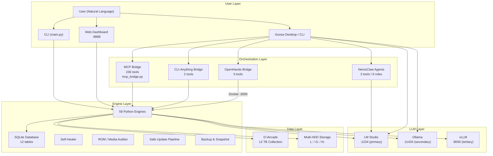
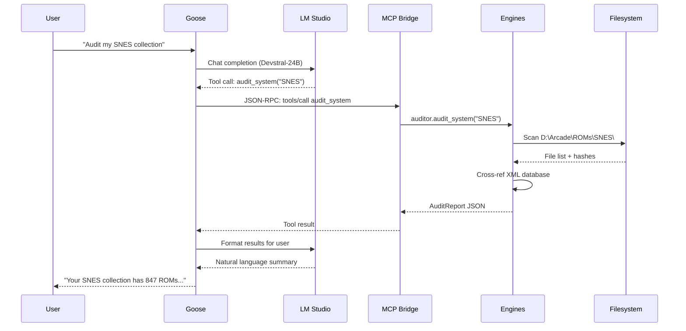
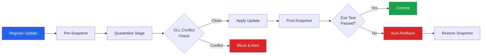
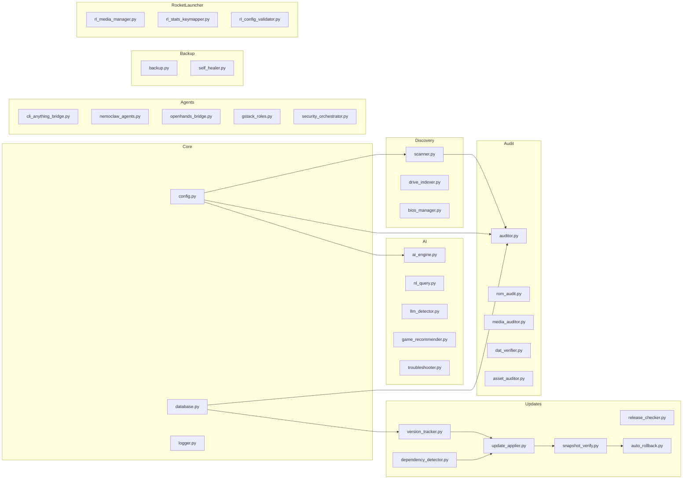
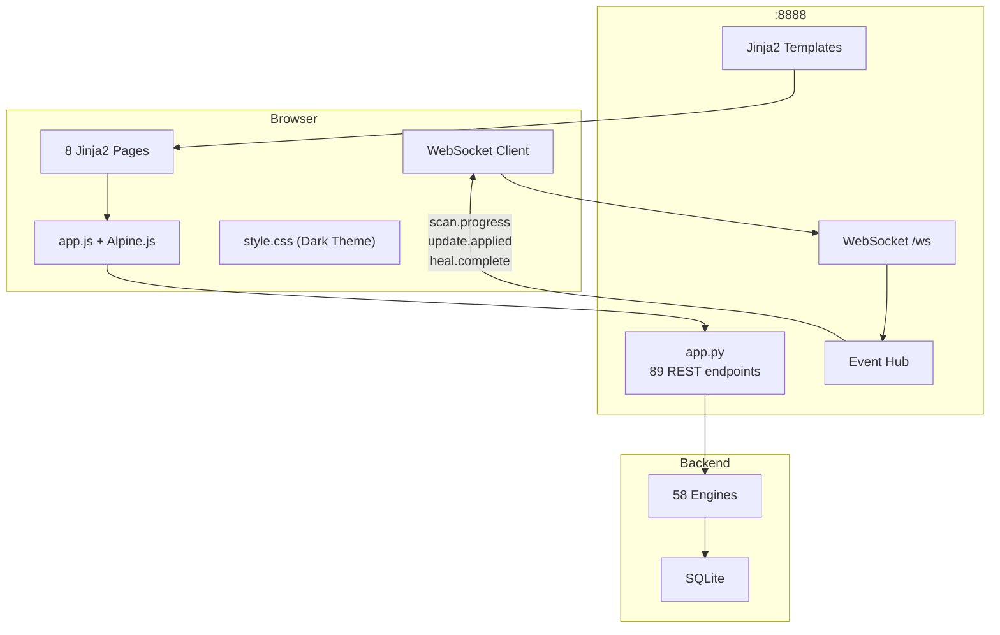
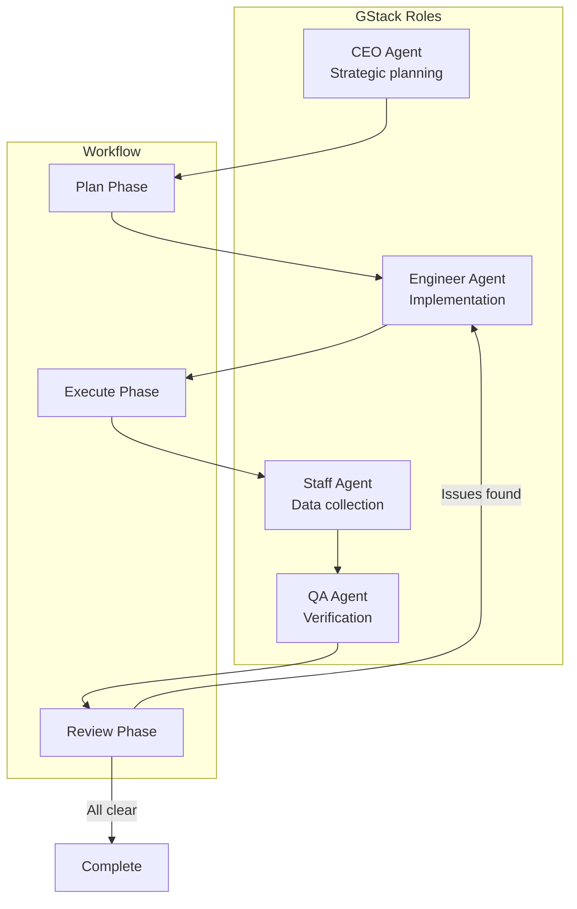
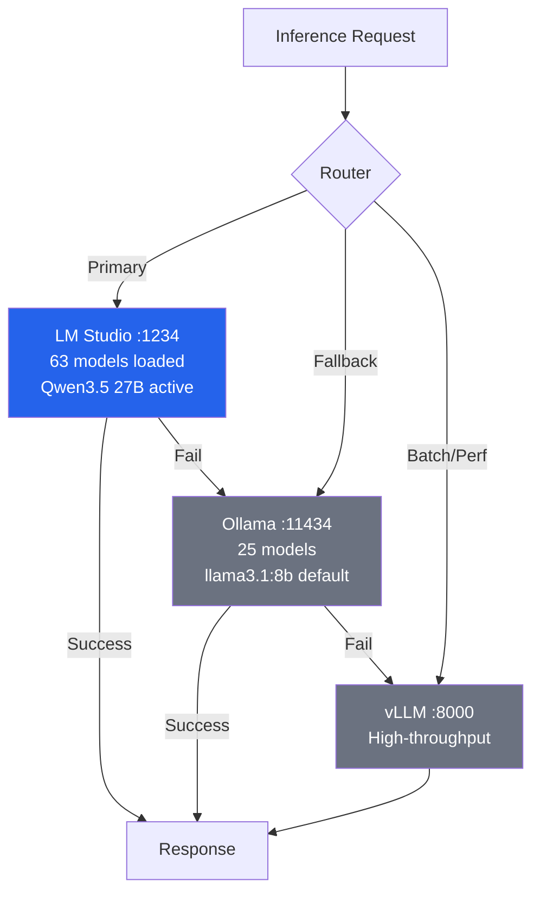
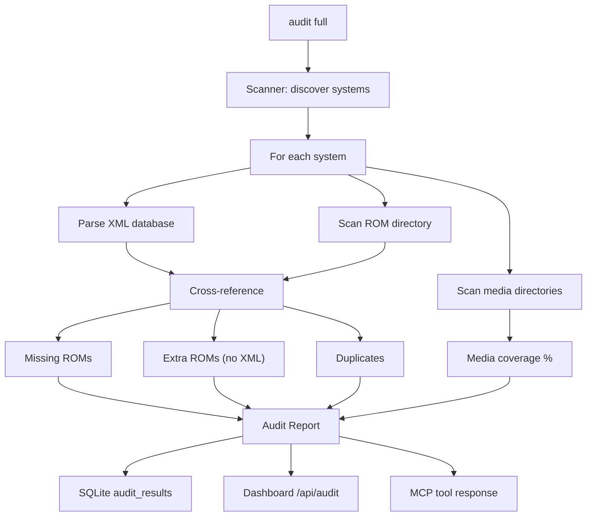
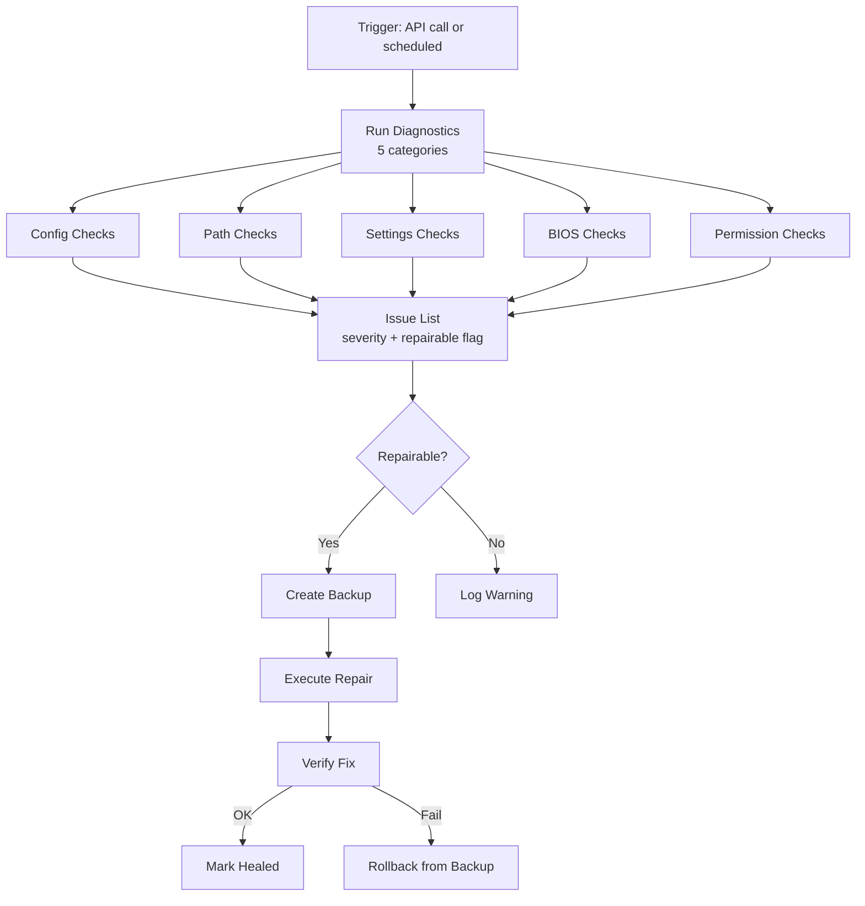
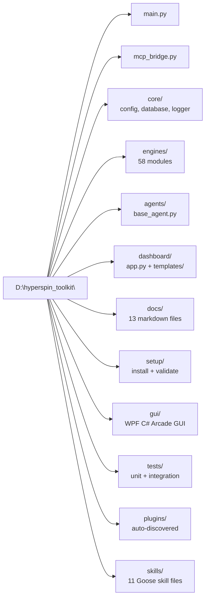

# HyperSpin Extreme Toolkit — Architecture Diagrams

> All diagrams use [Mermaid](https://mermaid.js.org/) syntax and render natively on GitHub.

---

## 1. High-Level System Architecture

---

## 2. Agentic Stack — MCP Communication Flow

---

## 3. Safe Update Pipeline

---

## 4. Engine Module Map

---

## 5. Web Dashboard Architecture

---

## 6. Multi-Agent Orchestration (GStack)

---

## 7. LLM Provider Chain

---

## 8. Data Flow — ROM Audit

---

## 9. Self-Healing System

---

## 10. Project File Structure

